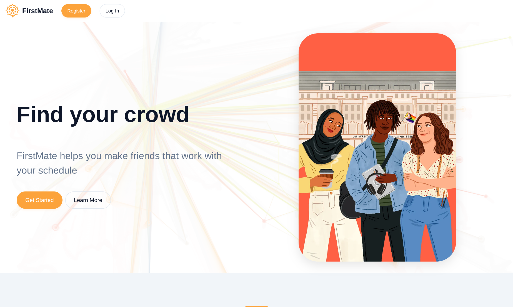
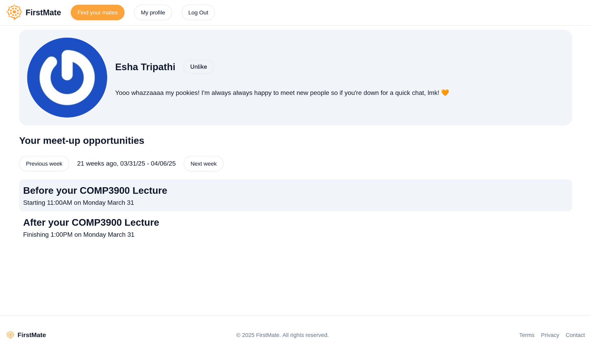

# FirstMate



Made with \<3 by:

| Person | Role |
| ------ | ---- |
| [Benjamin Van](https://github.com/benjaminvan5) | Developer |
| [Esha Tripathi](https://github.com/theEastBlue) | Lead frontend developer, lead designer |
| [Maddy Guthridge](https://maddyguthrige.com) | Lead backend developer |
| [Sid Saini](https://github.com/Sid00721) | Backend developer |

## How it works

Each user uploads their calendar. The system analyses users' calendars to rank
potential matches based on predicted times when they are on-campus at the same
time as you. When you view someone's profile, you can see the potential
opportunities to meet them based on your calendar.

.

## Maintenance

This project was created as a part of [UNSW DevSoc's `HACKaByte`](https://hackabyte.devpost.com/)
hackathon in March 2025.

The project has not been updated since then, and so likely has numerous
security vulnerabilities. Unless you intend on updating all the dependencies,
you should not run this in production.

## Copyright

Copyright &copy; Raising Elephants, 2025. You may not use this project for any
purposes without permission from the authors.

## Developing

We're using `uv` as a package manager.

### Set up `.env` file for development

Create a file `.env`, with contents adapted from the following

```shell
# Enable dev mode
FIRSTMATE_DEV=true
# Secret used for encrypting session cookie
FIRSTMATE_SECRET="your complex secret"
# Data directory path
FIRSTMATE_DATA="."
```

### Install dependencies

```sh
uv sync
```

### Run type checking

```sh
uv run basedpyright
```

### Run the app

```sh
uv run -m first_mate
```

## Deploying

Easiest with Docker Compose. Data file can't be written unless it was created
before the container starts. I don't know why, and I want to sleep, so I'll
troubleshoot some other time.
